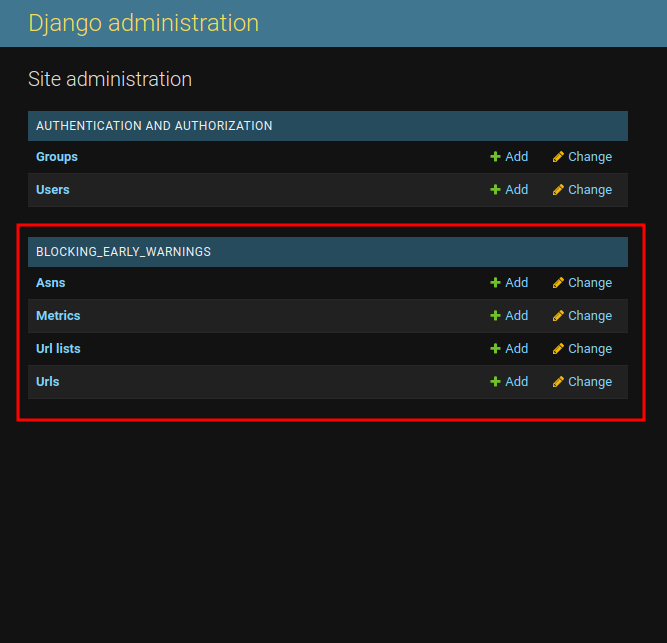

# Early Warnings

The Early Warnings App it's a django app to check for anomalies in web connectivity measurements for 
web pages using [Ooni](https://ooni.org/es/) data, and is maintained by the Venezuelan NGO [Venezuela Inteligente](https://veinteligente.org). 
We aim to provide additional features on the top of the excellent Ooni service that might be useful for digital rights activists around 
the world. 

## Highlights

This app aims to be reusable in your own django projects, as well as a stand alone app. In both cases, the main features are the 
following:

* Sending email notifications whenever a blocking event occurs
* Analysis of aggregated data, trying to find patterns common to generalized blocking events
* Graphs and tools to visualize stored data
* Defining multiple lists of urls that can be automatically updated

## Getting Started

You can use this app either as a **stand alone Django app** using docker, or as **modular app** that you can 
install in your own Django project. In the following tutorial you will learn how to install it in the way that
better fits your use case

### Installing as a standalone app

WIP: Standalone installation coming soon

### Installing as part of your Django project

The early warnings app is a regular django app like many others, so the process it's pretty much the same as with any app:

1. Download the the code from the [official repository](https://github.com)

        git clone https://github.com/VEinteligente/django-blocking-early-warning.git

2. **Install the django package with pip**, you have to specify the path to the cloned directory

        pip install -e /path/to/django-blocking-early-warning

3. Back in your django project, you just have to add this app as you'd do with any django app. The first step is 
**add the early warnings app to your installed apps**

        # settings.py

        INSTALLED_APPS = [

            # Your other apps

            "blocking_early_warnings" # new
        ]

4. Now you have to **add early warnings urls to your site**:

        # urls.py
        # ...
        from django.urls import path, include

        urlpatterns = [
            
            # Your other url patterns

            # Note that you might want to change the prefix here so the match
            # your project's guidelines
            path("early_warnings/", include("blocking_early_warnings.urls")) # new
        ]

    !!! note
        Note that this step is entirely optional as you might want to manage urls and views yourself, 
        so feel free to skip it to follow a more suitable installation for you. Otherwise, this is the simplest
        default installation.

5. And last but not least, we have to **run migrations** to add the database tables required by early warnings:

        python manage.py makemigrations blocking_early_warnings
        python manage.py migrate

And that's it, you now have the app succesfully installed in your project. You can check if everything's ok by 
running your server with `python manage.py runserver` and going to your `admin` panel, by default in `http://127.0.0.1:8000/admin/` 
and check for the new tables:

